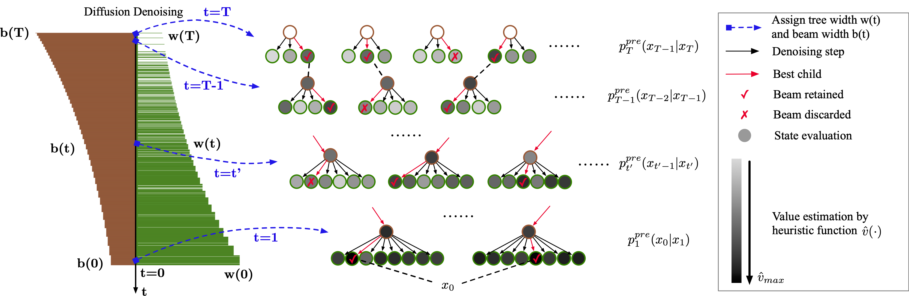
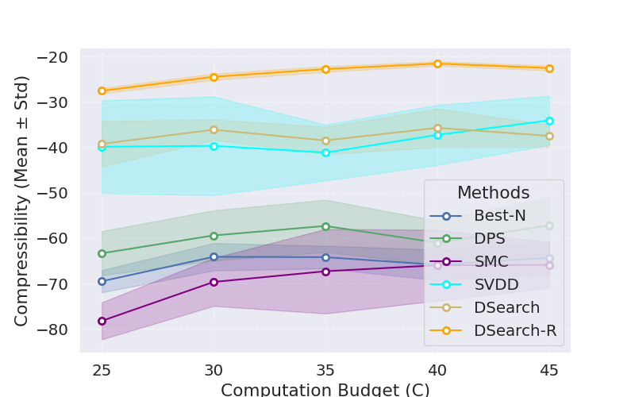
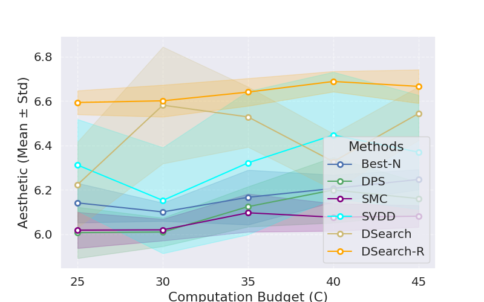
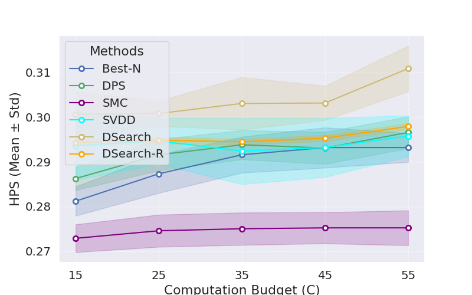

# Dynamic Search for Inference-Time Alignment in Diffusion Models (Images)

This code accompanies the paper on Dynamic Search for Inference-Time Alignment in Diffusion Models (DSearch), where the objective is to maximize downstream reward functions in diffusion models. In this implementation, we focus on generating **images** with high scores.  

Nottably, our algorithm is **derivative-free, training-free, and fine-tuning-free**.  



## Code

### Installation

Create a conda environment following this repo:

https://github.com/mihirp1998/AlignProp/

Then do:
```bash 
pip install scikit-learn
```

### Compressibility  

We use Stable Diffusion v1.5 as the pre-trained model. We optimize compressibility.  

Test the following for DSearch

### DSearch

DSearch 
```bash
CUDA_VISIBLE_DEVICES=0 python inference_decoding_nonp.py --reward 'compressibility' --bs 12 --num_images 12 --duplicate_size 5 --variant PM --w 5 --search_schudule exponential --drop_schudule exponential --oversamplerate 5
```
DSearch-R

Notes: choose a good replacerate for diversity/reward trade-off, usually 0.01~0.05, but note that we need bs*replacerate>=1. Generate multiple batches.
```bash
CUDA_VISIBLE_DEVICES=0 python inference_decoding_nonp.py --reward 'compressibility' --bs 34 --num_images 204 --duplicate_size 5 --variant PM --w 5 --search_schudule exponential --replacerate 0.03
```

### Baseline SVDD-PM

```bash
CUDA_VISIBLE_DEVICES=0 python inference_decoding_nonp.py --reward 'compressibility' --bs 12 --num_images 12 --duplicate_size 20 --variant PM
```

Here is the result.   

 


 

### Aesthetic score  

We use Stable Diffusion v1.5 as the pre-trained model. We optimize aesthetic scores.  

Run the following command:  

```bash
CUDA_VISIBLE_DEVICES=0 python inference_decoding_nonp.py --reward 'aesthetic' --bs 12 --num_images 12 --duplicate_size 5 --variant PM --w 5 --search_schudule exponential --drop_schudule exponential --oversamplerate 5
```

Here is the result.  




### Human preference score  

We use Stable Diffusion v1.5 as the pre-trained model. We optimize human preference scores.  

Run the following command:  

```bash
CUDA_VISIBLE_DEVICES=0 python inference_decoding_nonp.py --reward 'hps' --bs 12 --num_images 12 --duplicate_size 5 --variant PM --w 6 --search_schudule exponential --drop_schudule exponential --oversamplerate 5
```

Here is the result.  




### Acknowledgement  

Our codebase is directly built on top of [RCGDM](https://github.com/Kaffaljidhmah2/RCGDM)  

## Reference  

If you find this work useful in your research, please cite:

```bibtex
@article{li2025dynamic,
  title={Dynamic Search for Inference-Time Alignment in Diffusion Models},
  author={Li, Xiner and Uehara, Masatoshi and Su, Xingyu and Scalia, Gabriele and Biancalani, Tommaso and Regev, Aviv and Levine, Sergey and Ji, Shuiwang},
  journal={arXiv preprint arXiv:2503.02039},
  year={2025}
}
```  